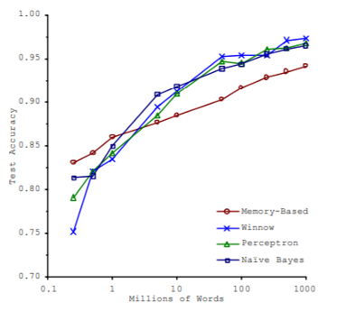

= 핸즈온 머신러닝 1장 한눈에 보는 머신러닝 - 1.5 머신러닝의 주요 도전 과제
정민호
2020-09-19
:jbake-last_updated: 2020-09-19
:jbake-type: post
:jbake-status: published
:jbake-tags: 데이터분석, 책정리
:description: '데이터분석 관련 책 `핸즈온 머신러닝 2판`의 1장 1.5절 머신러닝의 주요 도전 과제 요약 및 정리
:jbake-og: {"image": "img/jdk/duke.jpg"}
:idprefix:
:toc:
:sectnums:

---
== 한눈에 보는 머신러닝
---
=== https://anew0m.netlify.app/handsonml2_01-1[머신러닝이란?]
---
=== https://anew0m.netlify.app/handsonml2_01-2[왜 머신러닝을 사용하는가?]
---
=== https://anew0m.netlify.app/handsonml2_01-3[애플리케이션 사례]
---
=== https://anew0m.netlify.app/handsonml2_01-4[머신러닝 시스템의 종류]
---
=== https://anew0m.netlify.app/handsonml2_01-5[머신러닝의 주요 도전 과제]

****
* 머신러닝의 주요 작업은 학습 알고리즘을 선택해서 어떤 데이터에 훈련시키는 것
* 나쁜 알고리즘과 나쁜 데이터가 문제 될 수 있음
* 데이터에 완벽히 맞추는 것과 일반화를 위해 단순한 모델을 유지하는 것 사이의 올바른 균형을 찾는 것이 좋음
****

. 충분하지 않은 양의 훈련 데이터
* 대부분의 머신러닝 알고리즘이 잘 작동하려면 데이터가 많아야 함

. 대표성 없는 훈련 데이터
* 일반화가 잘되려면 우리가 일반화 하기 원하는 새로운 사례를 훈련 데이터가 잘 대표하는 것이 중요
* 샘플이 작으면 우연에 의한 대표성 없는 데이터로 샘플링 잡음(sampling noise) 발생
* 샘플이 클 때 표본 추출 방법이 잘못되면 대표성을 가지지 못하는 샘플링 편향(sampling bias), 비응답 편향(nonresponse bias) 발생

. 낮은 품질의 데이터
* 훈련 데이터가 에러, 이상치(outlier), 잡음으로 가득하면 내재된 패턴을 찾기 어려워 머신러닝 시스템이 잘 작동하지 않음
* 따라서 훈련 데이터 정제에 많은 시간을 투자함
* 일부 샘플에 특성 몇개가 빠졌을 때 훈련방법
** 특성 모두 무시
** 샘플 무시
** 빠진 값을 임의의값(평균 등)으로 채움
** 특성을 넣은 모델과 제외한 모델을 따로 훈련

. 관련 없는 특성
* 훈련에 사용할 좋은 특성들을 찾는것으로 특성 공학(feature engineering)이라 함
* 특성 공학의 작업
** 특성 선택(feature selection) : 가지고 있는 특성 중에서 훈련에 가장 유용한 특성을 선택
** 특성 추출(feature extraction) : 특성을 경합하여 더 유용한 특성을 만듬(차원축소 등)
** 새로운 데이터를 수집해 새 특성을 만듬

. 훈련 데이터 과대적합(overfitting)
* 모델이 훈련 데이터에 너무 잘 맞지만 일반성이 떨어지는것
* 과대적합은 훈련 데이터에 있는 잡음의 양에 비해 모델이 너무 복잡할 떄 발생
* 과대적합 해결방법
** 파라미터 수가 적은 모델을 선택하거나, 훈련 데이터에 있는 특성 수를 줄이거나 제약을 가하여 단순화
** 훈련 데이터를 더 많이 수집
** 훈련 데이터의 잡음을 최소화(오류 데이터 수정, 이상치 제거 등)
* 데이터에 완벽히 맞추는 것과 일반화를 위해 단순한 모델을 유지하는 것 사이의 올바른 균형을 찾는 것이 좋음

. 훈련 데이터 과소적합(underfitting)
* 모델이 너무 단순해서 데이터의 내재된 구조를 학습하지 못할 때 발생
* 과소적합 해결방법
** 모델 파라미터가 더 많은 강력한 모델 선택
** 학습 알고리즘에 더 좋은 특성을 제공(특성공학)
** 모델의 제약을 줄임(하이퍼파라미터 감소)
*** 하이퍼파라미터 : 학습알고리즘으로부터 영향을 받지 않으며, 훈련 전에 미리 지정되고, 훈련하는 동안에는 상수로 남아 있음

---
=== https://anew0m.netlify.app/handsonml2_01-6[테스트와 검증]
---
=== https://anew0m.netlify.app/handsonml2_01-7[연습문제]
---