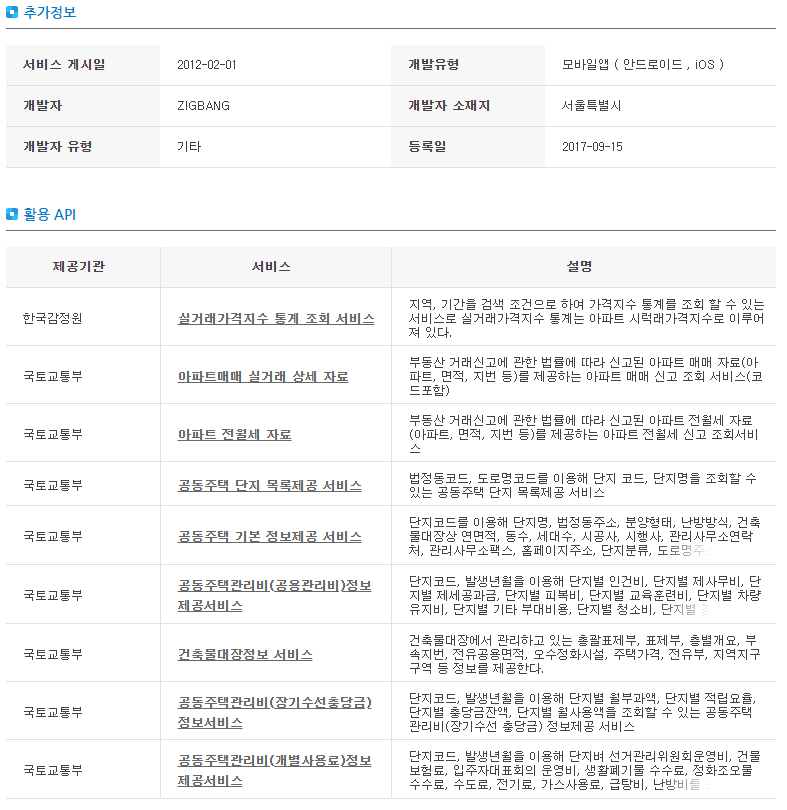
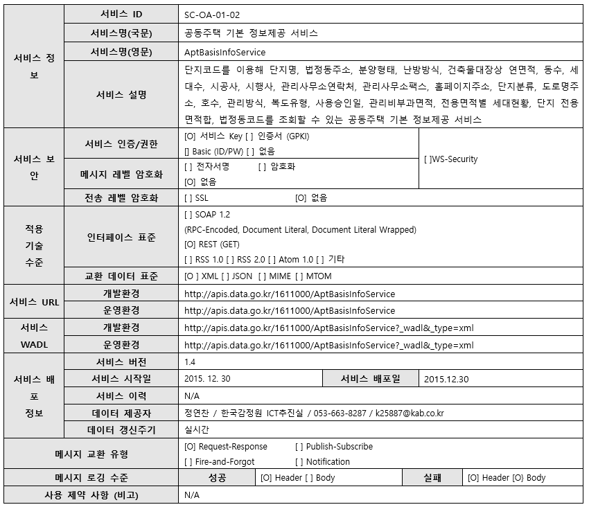
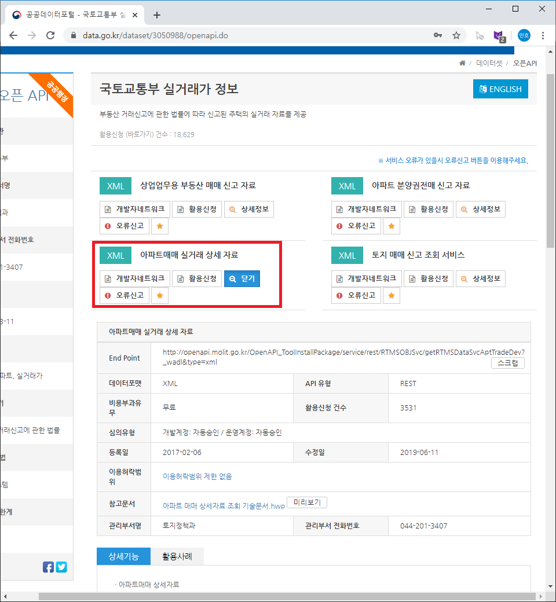
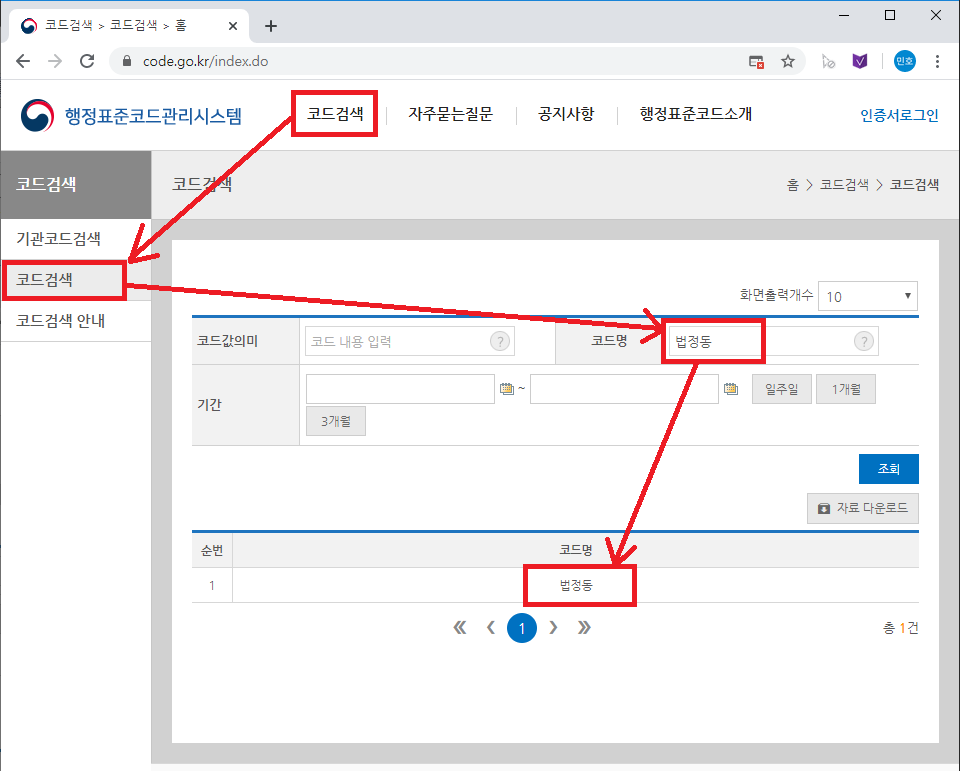
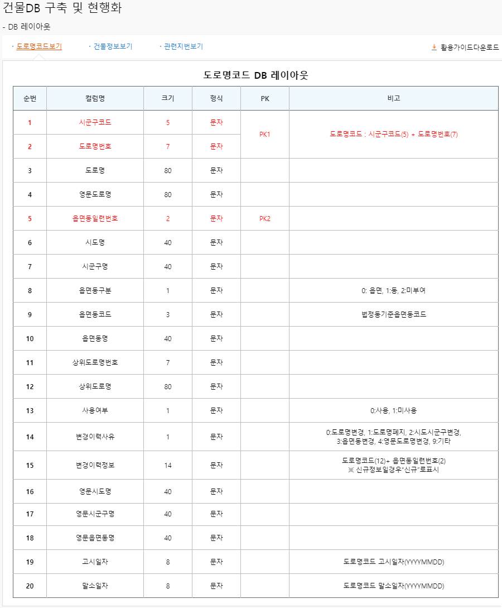
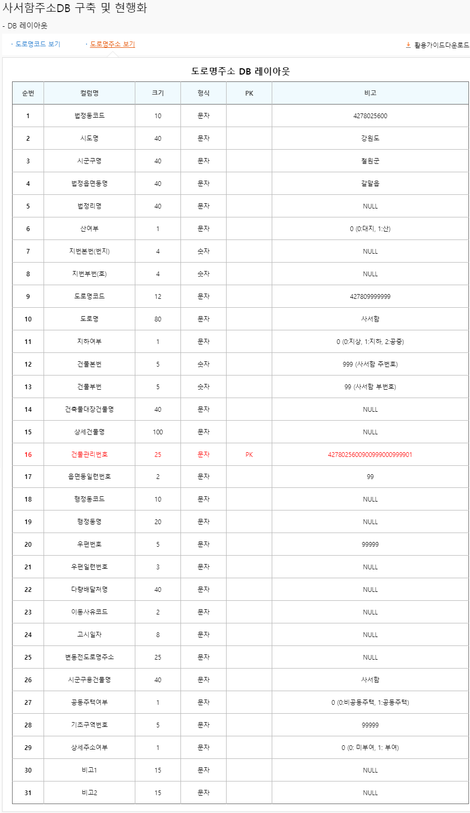
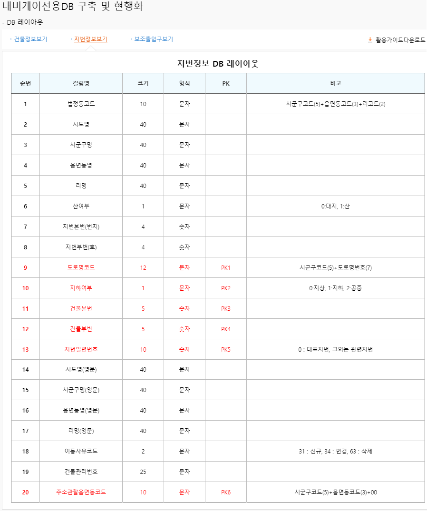
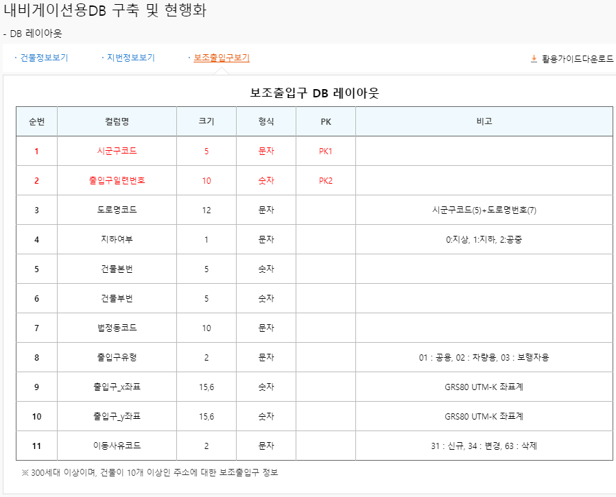

= 어떡하집 프로젝트 - 아파트 정보 수집 계획(아파트 정보 수집 방안 수립-1)
정민호
2020-02-28
:jbake-last_updated: 2020-02-28
:jbake-type: post
:jbake-status: published
:jbake-tags: 부동산, 개인프로젝트
:description: 공공데이터포털의 API를 이용해 아파트 정보를 수집합니다.
:jbake-og: {"image": "img/jdk/duke.jpg"}
:idprefix:
:toc:
:sectnums:

== 들어가며
네이버 부동산을 통해 https://www.data.go.kr/[공공데이터포털]에서 아파트와 관련된 정보를 수집할 수 있을것 같다는 힌트를 얻었습니다.
이후 공공데이터포털에서 아파트와 관련된 정보를 검색하다 우연히 '활용사례'를 알게 되었고 거기서 여러가지 부동산관련 시스템들이 어떤 공공데이터를 활용했는지 소개되어있었습니다.
저는 아래와 같은 시스템을 참고하였고, 그 중 https://www.data.go.kr/useCase/1007605/exam.do[직방]을 가장 많이 참조하였습니다.

- https://www.data.go.kr/useCase/1012000/exam.do[다방]
- https://www.data.go.kr/useCase/1009531/exam.do[밸류맵]
- https://www.data.go.kr/useCase/1007605/exam.do[직방]
- https://www.data.go.kr/useCase/1003914/exam.do[집토스(부동산 전월세)]
- https://www.data.go.kr/useCase/1006705/exam.do[집토스(주택-빌딩)]
- https://www.data.go.kr/useCase/1010115/exam.do[피터팬]
- https://www.data.go.kr/useCase/1003270/exam.do[호갱노노]

다른 활용사례들과는 달리 https://www.data.go.kr/useCase/1007605/exam.do[직방]에서는 다양한 API를 이용한 것을 보여주었습니다.

- 공동주택 단지 목록제공 서비스
- 공동주택 기본정보제공 서비스
- 아파트매매 실거래 상세 자료

그리고 그 중 아래 정보를 사용하고자 합니다.

== 공공데이터포털 활용
=== 공공데이터포털 활용 - https://www.data.go.kr/dataset/3039714/openapi.do[공동주택 단지 목록제공 서비스]
공동주택 단지 목록 제공 서비스는 아래 링크를 통해 접속할 수 있고 아래 그림에서 빨간 네모를 선택하시면 API를 보실 수 있습니다.

- https://www.data.go.kr/dataset/3039714/openapi.do - https://www.data.go.kr/dataset/3039714/openapi.do[공동주택 단지 목록제공 서비스]

image::img/HowHome/AptData/02/AptData03/data-aptList-01.png[공동주택단지목록API_1]

위 사진에서 참고문서를 다운로드 받으면 API 신청방법과 규격, 사용가이드가 기술되어 있습니다.
API 활용신청은 참고문서를 참조하여 신청하였습니다.

공동주택 단지목록제공의 주요 API의 규격은 REST-GET 방식으로 XML으로 제공하고 있었습니다.
데이터 갱신주기는 실시간으로 처리되고 있다고 기술되어있는데, 변화가 있는지 확인하려면 API를 돌려서 확인해야는건 아닌지 걱정 됩니다.

image::img/HowHome/AptData/02/AptData03/data-aptList-02.png[공동주택단지목록API_2]

공동주택 단지 목록 API는 법정동 기준의 아파트 목록과 도로명 기준의 아파트 목록으로 제공하고 있습니다.

==== 법정동 아파트 목록
법정동 목록은 최대 800 byte 크기로 제공되고 있고 평균 응답시간은 0.5 ms 로 기술되어 있습니다.

REST(GET)로 요청할 때 서비스키와 법정동코드를 필수 값으로 요구하고 있는데, 공공데이터포털에서 법정동코드를 제공하고 있는지 확인해봐야 할 것 같습니다.

그리고 제공되는 데이터는 단지코드와 단지명이 있고 이 데이터들은 Null 값이 없는 데이터로 확인됩니다.

image::img/HowHome/AptData/02/AptData03/data-aptList-03.png[공동주택단지목록API_3]

==== 도로명 아파트 목록
도로명 목록은 법정동 목록과 동일하게 최대 800 byte 크기로 제공되고 있고 평균 응답시간은 0.5 ms 로 기술되어 있습니다. 데이터 갱신주기는 실시간으로 정의되어 있습니다.

REST(GET)로 요청할 때 서비스키와 도로명코드를 필수 값으로 요구하고 있는데, 공공데이터포털에서 도로명코드를 제공하고 있는지 확인해봐야 할 것 같습니다.

그리고 제공되는 데이터는 단지코드와 단지명이 있고 이 데이터들은 Null 값이 없는 데이터로 확인됩니다.

image::img/HowHome/AptData/02/AptData03/data-aptList-04.png[공동주택단지목록API_4]

=== 공공데이터포털 활용 - https://www.data.go.kr/dataset/3039714/openapi.do[공동주택 기본정보제공 서비스]
공동주택 기본 정보 제공 서비스는 아래 링크를 통해 접속할 수 있고 아래 그림에서 빨간 네모를 선택하시면 API를 보실 수 있습니다.

- https://www.data.go.kr/dataset/3039714/openapi.do - https://www.data.go.kr/dataset/3039714/openapi.do[공동주택 기본 정보제공 서비스]

image::img/HowHome/AptData/02/AptData03/data-aptInfo-01.png[공동주택기본정보API_1]

위 사진에서 참고문서를 다운로드 받으면 API 신청방법과 규격, 사용가이드가 기술되어 있습니다.
API 활용신청은 참고문서를 참조하여 신청하였습니다.

공동주택 기본정보 또한 REST(GET) 규격으로 XML로 정보가 제공되고 있습니다.

공동주택은 최대 800 byte 크기로 제공되고 있고, 평균 응답시간은 0.5 ms 로 기술되어 있습니다.

REST(GET)로 요청할 때 서비스키와 단지코드를 필수 값으로 요구하고 있는데, 데이터 수집시 단지목록을 먼저 수집하고 이를 바탕으로 공동주택 기본 정보를 수집하는 순서로 진행되어야 할것 같습니다.

그리고 제공되는 데이터는 아파트 홈페이지주소와 도로명주소를 제외하고 모두 필수(NotNull)로 제공되고 있습니다.

image::img/HowHome/AptData/02/AptData03/data-aptInfo-03.png[공동주택기본정보API_3]

=== 공공데이터포털 활용 - https://www.data.go.kr/dataset/3050988/openapi.do[아파트매매 실거래 상세 자료]
아파트매매 실거래 상세 자료는 아래 링크를 통해 접속할 수 있고 아래 그림에서 빨간 네모를 선택하시면 API를 보실 수 있습니다.

- https://www.data.go.kr/dataset/3050988/openapi.do - https://www.data.go.kr/dataset/3050988/openapi.do[아파트매매 실거래 상세 자료]

위 사진에서 참고문서를 다운로드 받으면 API 신청방법과 규격, 사용가이드가 기술되어 있습니다.
API 활용신청은 참고문서를 참조하여 신청하였습니다.

아파트매매 실거래 상세자료 또한 REST(GET) 규격으로 XML로 정보가 제공되고 있습니다. 데이터 갱신주기는 일 1회로 정의되어 있습니다.

image::img/HowHome/AptData/02/AptData03/data-aptTrade-02.png[아파트매매실거래상세자료API_2]

아파트매매 실거래 상세자료는 최대 1,000 byte 크기로 제공되고 있고, 평균 응답시간은 500 ms 로 기술되어 있습니다.

REST(GET)로 요청할 때 서비스키와 지역코드(법정동), 계약년월을 필수 값으로 요구하고 있는데,
법정동의 지역코드를 요구하고 있기 때문에 데이터 수집시 공동주택 단지 목록 정보를 수집할 때 법정동 기준의 아파트 목록을 우선 시 하여 작업을 진행해야할 것 같습니다.

그리고 제공되는 데이터 모두 필수(NotNull)로 제공되고 있습니다.

image::img/HowHome/AptData/02/AptData03/data-aptTrade-03.png[아파트매매실거래상세자료API_3]

=== 주소정보

==== https://www.code.go.kr/index.do[행정표준코드관리시스템] - 법정동코드
법정동코드는 행정표준코드관리시스템에서 txt 파일로 제공하고 있습니다.
이를 csv 파일 형태로 변환하여 DB 생성 후 데이터를 구축하면 될것 같습니다.

행정표준코드관리시스템 사이트 주소는 아래와 같습니다.
- https://www.code.go.kr/index.do - https://www.code.go.kr/index.do[행정표준코드관리시스템]

image::img/HowHome/AptData/02/AptData03/data-bjdCode-01.png[법정동코드_1]

법정동 코드는 '법정동 코드 전체자료'를 통해 일괄로 받을 수 있지만, '법정동코드'와 '법정동명'만 제공합니다.

그래서 저는 조금 번거롭지만 '사용자 검색자료'로 데이터를 받았습니다.
검색자료로 받을 시 지역을 선택하고, 폐지구분을 전체, 원하는 출력항목을 모두 체크 하였습니다.
이렇게 데이터를 받는 이유는 단순히 두번 일하지 않기 위해서 입니다.
추가로 데이터가 필요 때 다시 한번 더 작업을 해야하기 때문에 조금 번거롭지만 사용자 검색자료로 수집하였습니다.

image::img/HowHome/AptData/02/AptData03/data-bjdCode-03.png[법정동코드_3]

==== http://www.juso.go.kr/addrlink/addrlinkJusoDBUse.do?menu=main&cPath=99MD[도로명주소] - 도로명주소DB
도로명주소 개발자센터에서는 도로명정보를 API와 DB형태로 구축할 수 있게 정보를 제공하고 있습니다.
도로명주소 개발자센터 사이트 주소는 아래와 같습니다.

- http://www.juso.go.kr/addrlink/addrlinkJusoDBUse.do?menu=main&cPath=99MD - http://www.juso.go.kr/addrlink/addrlinkJusoDBUse.do?menu=main&cPath=99MD[도로명주소 개발자센터]

도로명주소DB에서 제공되는 정보는 건물, 주소, 사서함주소, 위치정보, 영문주소, 상세주소 정보를 제공하고 있습니다.
핵심이 되는 정보는 건물 정보와 주소 정보로 추측되고, 건물과 주소 정보는 아래와 같이 정의하고 있습니다.

- 건물DB : 주소정보를 건물단위로 제공합니다. 아파트 등 집합건물의 경우 단지 내 동 단위 까지 정보가 제공됩니다.
- 주소DB : 아파트단지(또는 집합건물), 단독건물 등의 출입구 위치를 기준으로 부여된 주소 정보입니다. 아파트단지(또는 집합건물 등)가 여러 동으로 구성되어도 출입구 기준 하나의 주소정보만 제공됩니다.

정의된 정보를 볼 때 공공데이터포털에서 제공되는 정보는 주소정보를 하나만 가지고 있기 때문에, 도로명주소로 데이터를 제공한다면 '주소DB'를 기준으로 자료를 제공하고 있는것 같습니다.

건물과 주소정보 데이터를 구축하고 향후 무엇이 더 필요해질지 모르니 추가로 사서함주소와, 위치정보, 내비게이션용, 상세정보 DB 모두 구축하도록 진행하겠습니다.

DB 구축시 RDB로 구축할 예정이기 때문에 제공되는 정보들간 관계를 가질 수 있는지 파악해 보겠습니다.
먼저 각 정보의 PK정보를 알아보겠습니다.

- http://www.juso.go.kr/addrlink/addrlinkJusoDBUse.do?menu=rdnm[건물DB]
건물DB 정보는 도로명코드, 건물정보, 관련지번 총 3가지로 구성되어 있습니다.

도로명코드 정보의 PK는 시군구코드, 도로명번호, 읍면동일련번호 3개의 복합키로 구성되어있습니다.
이 중 시군구코드(5)와 도로명번호(7)를 합치면 도로명코드(12)가 됩니다.
FK로 추정되는 데이터는 9.읍면동코드, 11.상위도로명번호 가 있고, 그 중 11.상위도로명번호는 자기참조되는 FK인것 같습니다.

건물정보는 건물관리번호가 PK로 구성되어있고,
FK로 추정되는 데이터로 1.법정동코드, 9.도로명코드, 17.읍면동일련번호, 18.행정동코드, 20.우편번호 가 있습니다.

image::img/HowHome/AptData/02/AptData03/data-roadCode-1-02.png[건물DB_2]

관련지번 정보의 PK는 도로명코드, 지하여부, 건물본번, 건물부번, 지번일련번호 총 5개의 복합키로 구성되어있습니다.
FK로 추정되는 데이터는 1.법정동코드 가 있는것 같습니다.

image::img/HowHome/AptData/02/AptData03/data-roadCode-1-03.png[건물DB_3]

정리하면 아래 그림과 같이 도식화 할 수 있지 않을까 생각됩니다.

- http://www.juso.go.kr/addrlink/addrlinkJusoDBUse.do?menu=match[주소DB]
주소DB 정보는 도로명코드, 도로명주소, 지번(대표지번+관련지번), 부가정보 총 4가지로 구성되어 있습니다.

도로명코드 정보의 PK는 도로명코드, 읍면동일련번호 2개의 복합키로 구성되어 있습니다.
FK로 추정되는 데이터는 12.읍면동코드 가 있는것 같습니다.

image::img/HowHome/AptData/02/AptData03/data-roadCode-2-01.png[주소DB_1]

도로명주소 정보는 관리번호 라는 인조식별자를 PK로 가지고 있는것 같습니다.
FK는 2.도로명코드와 3.읍면동일련번호를 가지고 있습니다.

image::img/HowHome/AptData/02/AptData03/data-roadCode-2-02.png[주소DB_2]

지번(대표지번+관련지번) 정보의 PK는 관리번호, 일련번호 2개의 복합키로 구성되어있습니다.
FK는 1.관리번호와 3.법정동코드를 가지고 있는것 같습니다.

image::img/HowHome/AptData/02/AptData03/data-roadCode-2-03.png[주소DB_3]

부가정보의 PK는 관리번호 가 있으며, 관리번호는 FK로 도로명주소의 PK를 참조하고 있습니다.
따라서 부가정보와 도로명주소는 1:1 관계를 가지고 있는것 같습니다.
FK로 추정되는 데이터는 2.행정동코드, 4.우편번호 가 있는것 같습니다.

image::img/HowHome/AptData/02/AptData03/data-roadCode-2-04.png[주소DB_4]

- http://www.juso.go.kr/addrlink/addrlinkJusoDBUse.do?menu=post[사서함주소DB]
사서함주소DB 정보는 도로명코드, 도로명주소 총 2가지로 구성되어있습니다.
2가지 정보는 각각 건물DB와 주소DB로 연결할 수 있게 가이드가 기술되어 있었고, 기술된 내용의 매핑순번으로 볼 때 건물DB를 기준으로하여 만들어 진것 같습니다.
기술된 내용은 아래에 작성하였습니다.

도로명코드 정보의 PK는 시군구코드, 도로명번호, 읍면동일련번호 총 3개의 복합키로 구성되어 있습니다.
FK로 추정되는 데이터는 9.읍면동코드, 11.상위도로명번호 가 있는것 같습니다. 11.상위도로명번호는 자기참조하는 FK인것 같습니다.

image::img/HowHome/AptData/02/AptData03/data-roadCode-3-01.png[사서함주소DB_1]

도로명주소보기 정보의 PK는 건물관리번호로 인조식별자를 PK로 가지고 있는것 같습니다.
FK로 추정되는 데이터는 1.법정동코드, 9.도로명코드, 18.행정동코드, 20.우편번호 가 있는것 같습니다.

그리고 사서함주소DB를 건물DB와 주소DB로 연결할 수 있게 아래와 같이 기술되어 있습니다.

건물DB와 연결할 때는 20개의 속성이 상호 연결되어야 합니다.

image::img/HowHome/AptData/02/AptData03/data-roadCode-3-03.png[사서함주소DB_3]

주소DB와 연결할 때는 17개의 속성이 상호 연결되어야 합니다.
건물DB와 차이점으로는 매핑 순번이 다르고 도로번호와 상위도로명번호, 상위도로명을 제외하고 데이터는 동일합니다.

image::img/HowHome/AptData/02/AptData03/data-roadCode-3-04.png[사서함주소DB_4]

- http://www.juso.go.kr/addrlink/addrlinkJusoDBUse.do?menu=geodata[위치정보요약DB]
위치정보요약DB는 도로명코드, 지하여부, 건물본번, 건물부번, 법정동코드 총 5개의 복합키로 PK가 정의되어 있습니다.
FK로 추정되는 데이터는 1.시군구코드, 13.우편번호 가 있습니다.

image::img/HowHome/AptData/02/AptData03/data-roadCode-4-01.png[위치정보요약DB_1]

- http://www.juso.go.kr/addrlink/addrlinkJusoDBUse.do?menu=engj[영문주소DB]
영문주소DB는 건물관리번호, 법정동코드, 산여부, 지번본번(번지), 지번부번(호) 총 5개의 복합키로 PK가 정의되어 있습니다.
FK로 추정되는 데이터는 9.도로명코드, 15.우편번호 가 있습니다.

image::img/HowHome/AptData/02/AptData03/data-roadCode-5-01.png[영문주소DB_1]

- http://www.juso.go.kr/addrlink/addrlinkJusoDBUse.do?menu=navi[네비게이션용DB]
네비게이션용DB는 건물정보, 지번정보, 보조출입구 총 3가지로 구성되어있습니다.

건물정보의 PK는 건물관리번호 이며,
FK로 추정되는 데이터는 1.주소관할읍면동코드, 5.도로명코드, 10.우편번호, 14.행정동코드 가 있습니다.

image::img/HowHome/AptData/02/AptData03/data-roadCode-6-01.png[내비게이션용DB_1]

지번정보의 PK는 도로명코드, 지하여부, 건물본번, 건물부번, 지번일련번호, 주소관할읍면동코드 총 6개의 복합키로 PK가 정의되어 있습니다.
FK로 추정되는 데이터는 1.법정동코드, 19.건물관리번호 가 있습니다.

보조출입구 정보의 PK는 시군구코드, 출입구일련번호 총 2개의 복합키로 PK가 정의되어 있습니다.
FK로 추정되는 데이터는 3.도로명코드, 7.법정동코드 가 있습니다.

- http://www.juso.go.kr/addrlink/addrlinkJusoDBUse.do?menu=detailadr[상세주소DB]
상세주소DB의 PK는 시군구코드, 동일련번호, 층일련번호, 호일련번호, 호접미사일련번호 총 5개의 복합키로 구성되어 있습니다.
FK는 11.건물관리번호와 12.법정동코드, 13.도로명코드, 14.지하여부, 15.건물본번, 16.건물부번 이 있습니다.

image::img/HowHome/AptData/02/AptData03/data-roadCode-7-01.png[상세주소DB_1]

정리하면 대략 아래의 ERD(?) 와 같이 관계가 구성되어 질 것같습니다.
관계정보를 명확하게 정의한 주소DB를 제외하곤 다른 DB 정보들은 관계가 명확하지 않았기에 추측으로만 연결할 수 있었습니다.
아파트 관련 데이터 수집을 위해 우선적으로 주소DB를 구축하고 추후 다른DB를 모델링하고 DB구축을 하도록 진행하도록 하겠습니다.

_(ERD는 DA# 4를 이용하여 작성하였고, 비영리 목적으로 사용할 수 있는 공개용 버전을 사용하였습니다. 참고URL : http://dataware.kr/solution/new_download/571866)_

image::img/HowHome/AptData/02/AptData03/data-roadCode-8-01.png[ERDDB_1]

