= 어떡하집 프로젝트 - 아파트 정보 수집 계획(아파트 정보 수집 방안 수립-2)
정민호
2020-02-29
:jbake-last_updated: 2020-02-29
:jbake-type: post
:jbake-status: published
:jbake-tags: 부동산, 개인프로젝트
:description: 파이썬3을 이용해 공공데이터포털의 이용해 아파트 정보를 수집합니다.
:jbake-og: {"image": "img/jdk/duke.jpg"}
:idprefix:
:toc:
:sectnums:

== 들어가며
공공데이터 포털을 파이썬을 이용해 데이터를 수집해 보려고 합니다.
파이썬을 사용하면서 사용할 툴은 아래와 같습니다.

- https://www.anaconda.com/distribution/ - https://www.anaconda.com/distribution/[아나콘다]
- https://www.jetbrains.com/pycharm/ - https://www.jetbrains.com/pycharm/[파이참]

아나콘다에는 파이썬을 비롯한 유용한 라이브러리가 포함되어 있습니다.
가볍게 파이썬만 설치하는것 보다 아나콘다를 설치하는게 편하지 않을까 생각합니다.

파이썬 설치 및 아나콘다 설치는 아래 URL을 참고하여 설치하였습니다.

- https://bradbury.tistory.com/63 - https://bradbury.tistory.com/63[파이참(PyCharm) 설치 및 아나콘다 가상환경 적용]

== 공공데이터포털
공공데이터포털에서 활용신청한 데이터는 '마이페이지 -> 오픈API -> 개발계정' 으로 접근하면 아래의 그림처럼 목록을 보실 수 있습니다.

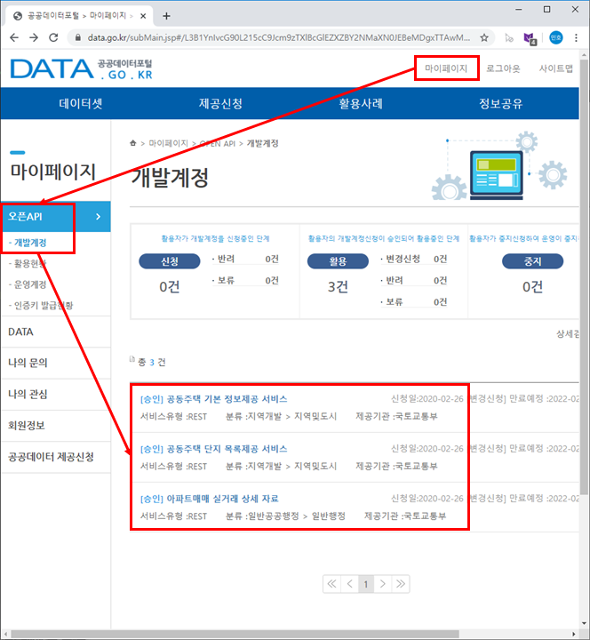

=== 공동주택 단지 목록제공 서비스
먼저 공동주택 단지 목록 제공 서비스에서 데이터를 가져와 보겠습니다.
공동주택 단지 목록 제공 서비스에 접속하시면 아래의 그림처럼 보실 수 있습니다.

image::img/HowHome/AptData/02/AptData04/data-aptInfo-02-1-01.png[단지목록-1]

하단의 상세기능정보에서 도로명 아파트 목록의 '실행'버튼을 클릭하면 팝업창이 뜨게 됩니다.
팝업창에서 인증키를 입력하고 미리보기를 클릭합니다.

만약 인증키를 신청하지 않으셨다면, 페이지 상단에서 키발급을 받으시면 됩니다.

image::img/HowHome/AptData/02/AptData04/data-aptInfo-02-1-02.png[단지목록-2]

미리보기를 클릭하면 아래의 그림처럼 페이지가 뜨게 됩니다.
여기서 필요한 정보는 상단의 URL 정보가 필요하며,
상단의 URL 정보를 가져오면 아래와 같은 정보를 얻을 수 있습니다.

http://apis.data.go.kr/1611000/AptListService/getRoadnameAptList?serviceKey={인증키}&roadCode={도로명코드}&pageNo={페이지번호}&numOfRows={페이지목록건수}

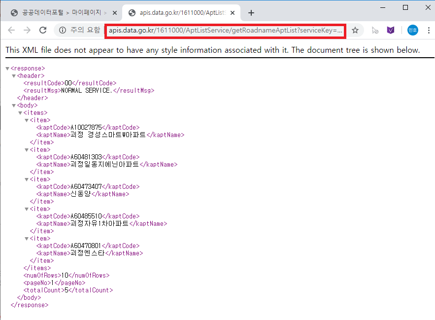

GET 방식을 사용하므로 가져온 URL은 아래와 같이 분류 할 수 있을 것 같습니다.
이 정보들을 이용해 파이썬 코드를 작성해 보겠습니다.

- URL 주소 : http://apis.data.go.kr/1611000/AptListService/getRoadnameAptList?
- 요청변수 : ?serviceKey={인증키}
- 요청변수 : &roadCode={도로명코드}
- 요청변수 : &pageNo={페이지번호}
- 요청변수 : &numOfRows={페이지목록건수}

파이참을 실행하고 프로젝트를 생성 후 API를 테스트할 *.py 파일을 생성합니다.

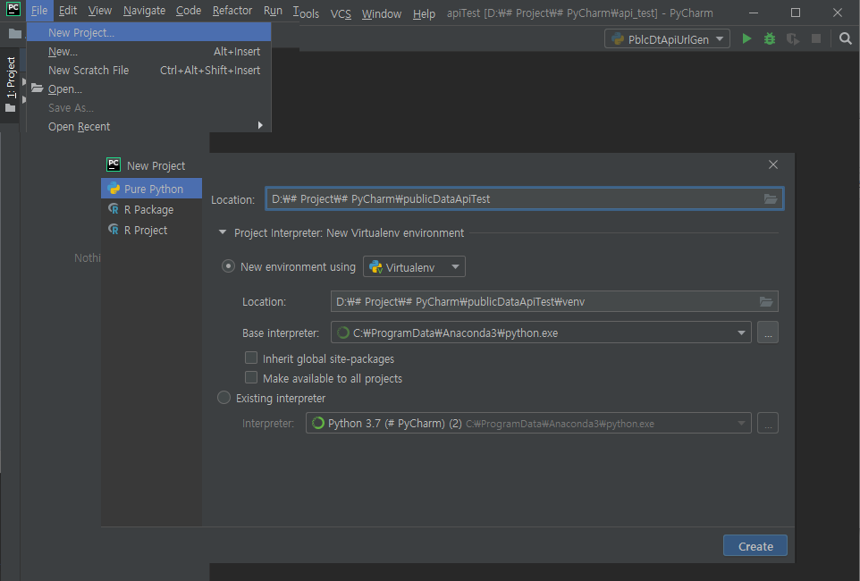
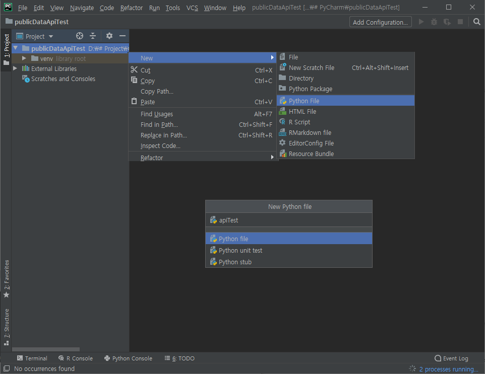

API를 이용해 데이터를 가져오고 json으로 변환하기 위해 requesets, xmltodict, json 라이브러리를 사용합니다.
파이참에서 라이브러리 설치 및 코드스타일 설정은 아래의 URL을 참조하였습니다.

- https://tariat.tistory.com/692 - https://tariat.tistory.com/692[파이참(pycharm)에서 라이브러리 쉽게 설치하는 방법!]
- https://velog.io/@city7310/파이썬-코드-포매터-이야기-5wjxdei9iv - https://velog.io/@city7310/%ED%8C%8C%EC%9D%B4%EC%8D%AC-%EC%BD%94%EB%93%9C-%ED%8F%AC%EB%A7%A4%ED%84%B0-%EC%9D%B4%EC%95%BC%EA%B8%B0-5wjxdei9iv[파이썬 코드 스타일 이야기 - (1) Style Checker, Formatter들 구경하기]

[source,python,linenums]
----
import requests, xmltodict, json

# 테스팅 관련 변수
testYn      = True
#testYn      = False

# 공공데이터 포털 API 호출관련 기본 변수
serviceKey  = "1UUVwM6YiEySmXbqM%2FLN2f3ZP%2F90D7WxGIsw8ROq1eSkW36ZJuS4YMXKAX12UF2SQtXoZ700EadKIRu2fUp7Ew%3D%3D"
pageNo      = "1"   # 페이지번호
numOfRows   = "100"  # 페이지내목록수

# 아파트목록 관련 변수
roadCode    = "263802006002"    # 도로명코드
bjdCode     = "2638010100"      # 법정동코드

# 에러관련 변수
ERR_STATUS_CODE  = "ERR_STATUS_CODE"
ERR_RESULT_CODE  = "ERR_RESULT_CODE"

"""
'아파트(도로명) 목록 ' API 호출을 위한 URL 생성
https://www.data.go.kr/dataset/3039714/openapi.do

## NN -> 필수(notNull)
serviceKey NN 서비스키
roadCode   MM 도로명코드(12자리(시군구번호+도로명번호))
pageNo        페이지 번호
numOfRows     한 페이지 결과 수
"""
def getStrFromAptListInfoRoadUrl( testYn, serviceKey, roadCode, pageNo, numOfRows ) :
    url = "http://apis.data.go.kr/1611000/AptListService/getRoadnameAptList?serviceKey={}&roadCode={}&pageNo={}&numOfRows={}".format(serviceKey, roadCode, pageNo, numOfRows)
    return url

"""
'아파트(법정동) 목록 ' API 호출을 위한 URL 생성
https://www.data.go.kr/dataset/3039714/openapi.do

## NN -> 필수(notNull)
serviceKey NN 서비스키
roadCode   MM 도로명코드(12자리(시군구번호+도로명번호))
pageNo        페이지 번호
numOfRows     한 페이지 결과 수
"""
def getStrFromAptListInfoBjdUrl( testYn, serviceKey, bjdCode, pageNo, numOfRows ) :
    url = "http://apis.data.go.kr/1611000/AptListService/getLegaldongAptList?serviceKey={}&bjdCode={}&pageNo={}&numOfRows={}".format(serviceKey, bjdCode, pageNo, numOfRows)
    return url

"""
URL을 통해 API를 호출하여 결과값 JSON으로 생성
"""
def getJsonFromUrlContent( url ) :
    response = requests.get(url)
    if( testYn == True ) :
        print("response")
        print(response)
        print("status code :", response.status_code)

    # Err 체크
    if( response.status_code != 200 ) :
        return ERR_STATUS_CODE

    response = response.content
    if (testYn == True):
        print("response")
        print(response)

    dict = xmltodict.parse(response)
    if( testYn == True ) :
        print("dict")
        print(dict)
        print("resultCode :", json.dumps(dict['response']['header']['resultCode']))

    resultCode = json.dumps(dict['response']['header']['resultCode'], ensure_ascii=False)
    print(resultCode)
    # Err 체크
    if( json.dumps(dict['response']['header']['resultCode'], ensure_ascii=False) != "\"00\"" ) :
    #if( resultCode != "\"00\"" ) :
        return ERR_RESULT_CODE

    jsonString = json.dumps(dict['response']['body'], ensure_ascii=False)
    jsonObj = json.loads(jsonString)
    if( testYn == True ) :
        print("jsonObj")
        print(jsonObj)

    return jsonObj

def checkJsonObj( jsonObj ) :
    ERR_STATUS_CODE = "ERR_STATUS_CODE"
    ERR_RESULT_CODE = "ERR_RESULT_CODE"

    if( jsonObj == ERR_STATUS_CODE ) :
        return False
    elif( jsonObj == ERR_RESULT_CODE ) :
        return False
    else :
        return True

url = getStrFromAptListInfoBjdUrl( testYn, serviceKey, bjdCode, pageNo, numOfRows )            # 아파트목록(법정동)
jsonObj = getJsonFromUrlContent(url)

if ( checkJsonObj(jsonObj) ) :
    for item in jsonObj['items']['item'] :
        print(item)
else :
    print("ERR")
----

위 코드를 실행시키면 아래와 같이 정상적으로 데이터를 받아오는걸 확인 할 수 있습니다.

=== 공동주택 기본 정보제공 서비스
공동주택 기본 정보제공 서비스에 접속하시면 아래의 그림처럼 보실 수 있습니다.

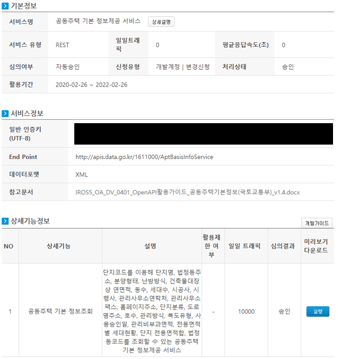

하단의 상세기능정보에서 공동주택 기본 정보조회의 '실행'버튼을 클릭하면 팝업창이 뜨게 됩니다.
팝업창에서 인증키를 입력하고 미리보기를 클릭합니다.

만약 인증키를 신청하지 않으셨다면, 페이지 상단에서 키발급을 받으시면 됩니다.

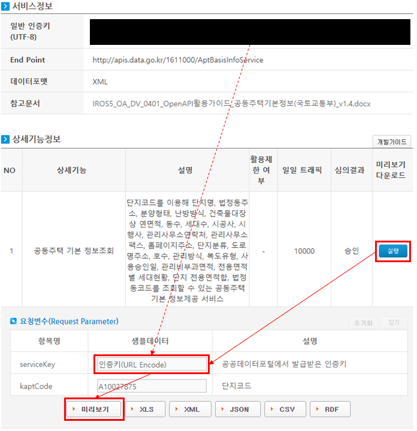

미리보기를 클릭하면 아래의 그림처럼 페이지가 뜨게 됩니다.
여기서 필요한 정보는 상단의 URL 정보가 필요하며,
상단의 URL 정보를 가져오면 아래와 같은 정보를 얻을 수 있습니다.

http://apis.data.go.kr/1611000/AptBasisInfoService/getAphusBassInfo?serviceKey={인증키}&kaptCode={단지코드}

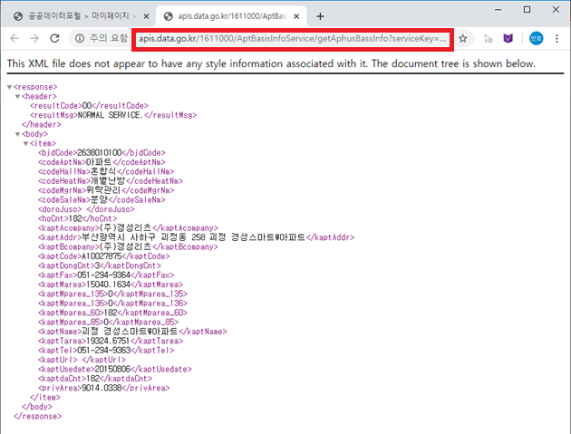

GET 방식을 사용하므로 가져온 URL은 아래와 같이 분류 할 수 있을 것 같습니다.
이 정보들을 이용해 파이썬 코드를 작성해 보겠습니다.

- URL 주소 : http://apis.data.go.kr/1611000/AptBasisInfoService/getAphusBassInfo
- 요청변수 : ?serviceKey={인증키}
- 요청변수 : &kaptCode={단지코드}

기존에 작성했던 코드에 아래 함수를 추가 작성하였습니다.

[source, python, linenum]
----
# 아파트 기본정보 관련 변수
kaptCode    = "A10027875"

"""
'아파트 기본정보 ' API 호출을 위한 URL 생성
https://www.data.go.kr/dataset/3039714/openapi.do

## NN -> 필수(notNull)
serviceKey NN 서비스키
kaptCode   MM 단지코드
"""
def getStrFromAptInfoUrl( testYn, serviceKey, kaptCode ) :
    url = "http://apis.data.go.kr/1611000/AptBasisInfoService/getAphusBassInfo?serviceKey={}&kaptCode={}".format(serviceKey, kaptCode)
    return url

url = getStrFromAptInfoUrl( testYn, serviceKey, kaptCode )
jsonObj = getJsonFromUrlContent(url)

print(jsonObj['item'])
----

위 코드를 실행시키면 아래와 같이 정상적으로 데이터를 받아오는걸 확인 할 수 있습니다.

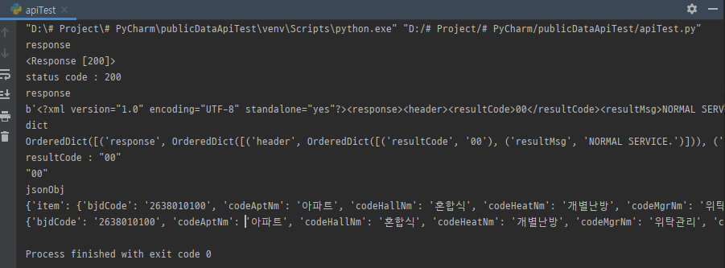

=== 아파트 실거래 상세 자료
아파트 실거래 상세 자료에 접속하시면 아래의 그림처럼 보실 수 있습니다.

image::img/HowHome/AptData/02/AptData04/data-aptInfo-02-3-01.png[아파트실거래-1]

하단의 상세기능정보에서 공동주택 기본 정보조회의 '실행'버튼을 클릭하면 팝업창이 뜨게 됩니다.
팝업창에서 인증키를 입력하고 미리보기를 클릭합니다.

만약 인증키를 신청하지 않으셨다면, 페이지 상단에서 키발급을 받으시면 됩니다.

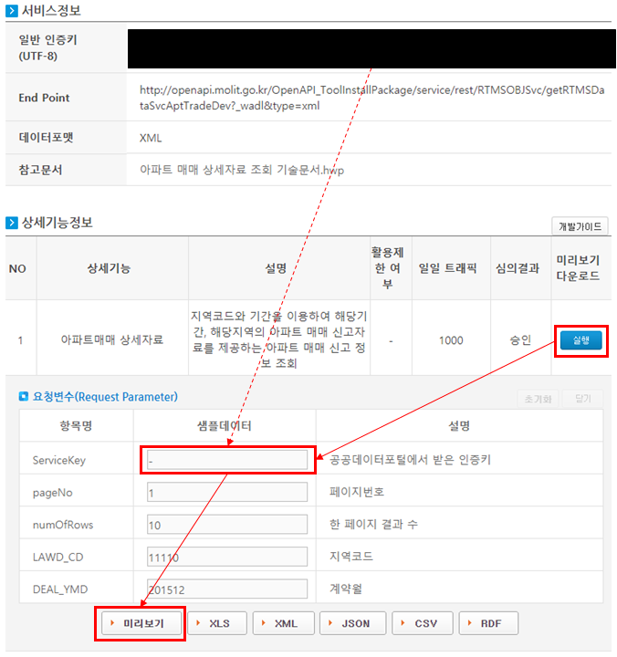

미리보기를 클릭하면 아래의 그림처럼 페이지가 뜨게 됩니다.
여기서 필요한 정보는 상단의 URL 정보가 필요하며,
상단의 URL 정보를 가져오면 아래와 같은 정보를 얻을 수 있습니다.

http://openapi.molit.go.kr/OpenAPI_ToolInstallPackage/service/rest/RTMSOBJSvc/getRTMSDataSvcAptTradeDev?serviceKey={인증키}&pageNo={페이지번호}&numOfRows={페이지목록건수}&LAWD_CD={지역코드}&DEAL_YMD={계약년월}

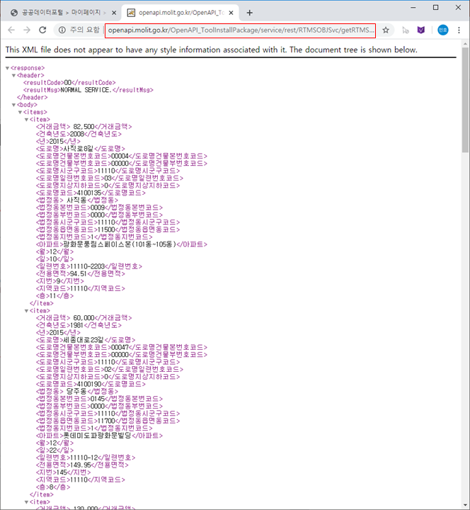

GET 방식을 사용하므로 가져온 URL은 아래와 같이 분류 할 수 있을 것 같습니다.
이 정보들을 이용해 파이썬 코드를 작성해 보겠습니다.

- URL 주소 : http://openapi.molit.go.kr/OpenAPI_ToolInstallPackage/service/rest/RTMSOBJSvc/getRTMSDataSvcAptTradeDev
- 요청변수 : ?serviceKey={인증키}
- 요청변수 : &pageNo={페이지번호}
- 요청변수 : &numOfRows={페이지목록건수}
- 요청변수 : &LAWD_CD={지역코드}
- 요청변수 : &DEAL_YMD={계약년월}

기존에 작성했던 코드에 아래 함수를 추가 작성하였습니다.

[source, python, linenum]
----
# 아파트 실거래 관련 변수
LAWD_CD     = "11110"   # 지역코드
DEAL_YMD    = "201512"  # 계약년월

"""
'아파트매매 실거래 상세 자료' API 호출을 위한 URL 생성
https://www.data.go.kr/dataset/3050988/openapi.do

## NN -> 필수(notNull)
serviceKey NN 서비스키
pageNo        페이지 번호
numOfRows     한 페이지 결과 수
LAWD_CD    NN 지역코드
DEAL_YMD   NN 계약월
"""
def getStrFromAptTradeInfoUrl( testYn, serviceKey, pageNo, numOfRows, LAWD_CD, DEAL_YMD ) :
    url = "http://openapi.molit.go.kr/OpenAPI_ToolInstallPackage/service/rest/RTMSOBJSvc/getRTMSDataSvcAptTradeDev?serviceKey={}&pageNo={}&numOfRows={}&LAWD_CD={}&DEAL_YMD={}".format(serviceKey, pageNo, numOfRows, LAWD_CD, DEAL_YMD)
    return url

url = getStrFromAptTradeInfoUrl( testYn, serviceKey, pageNo, numOfRows, LAWD_CD, DEAL_YMD )    # 아파트실거래정보
jsonObj = getJsonFromUrlContent(url)

if ( checkJsonObj(jsonObj) ) :
    for item in jsonObj['items']['item'] :
        print(item)
else :
    print("ERR")
----

위 코드를 실행시키면 아래와 같이 정상적으로 데이터를 받아오는걸 확인 할 수 있습니다.

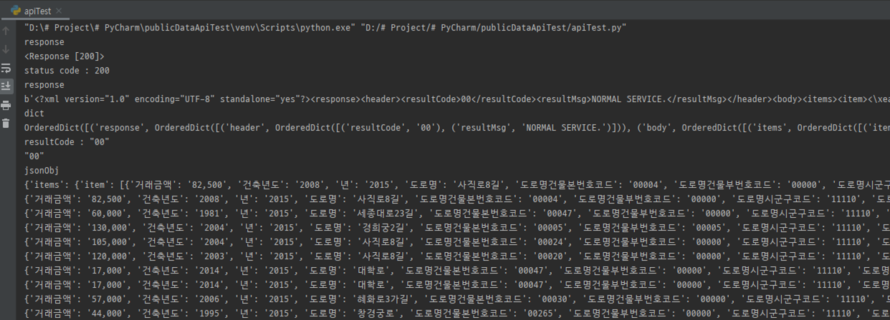

== 공공데이터포털 전체 코드
공공데이터를 가져오는 코드는 각 API 별로 함수화하여 코드를 작성하였습니다.
공공데이터 API를 테스트하기 위해 함수화 했지만 아직 코드에 https://ko.wikipedia.org/wiki/%EC%BD%94%EB%93%9C_%EC%8A%A4%EB%A9%9C[나쁜냄새]가 존재하는것 같습니다.

추후 이 코드를 리팩토링해보겠습니다.

아래는 작성한 전체 코드 입니다.

[source, python, linenum]
----
import requests, xmltodict, json

# 테스팅 관련 변수
testYn      = True
#testYn      = False

# 공공데이터 포털 API 호출관련 기본 변수
serviceKey  = "1UUVwM6YiEySmXbqM%2FLN2f3ZP%2F90D7WxGIsw8ROq1eSkW36ZJuS4YMXKAX12UF2SQtXoZ700EadKIRu2fUp7Ew%3D%3D"
pageNo      = "1"   # 페이지번호
numOfRows   = "100"  # 페이지내목록수

# 아파트목록 관련 변수
roadCode    = "263802006002"    # 도로명코드
bjdCode     = "2638010100"      # 법정동코드

# 아파트 기본정보 관련 변수
kaptCode    = "A10027875"

# 아파트 실거래 관련 변수
LAWD_CD     = "11110"   # 지역코드
DEAL_YMD    = "201512"  # 계약년월

# 에러관련 변수
ERR_STATUS_CODE  = "ERR_STATUS_CODE"
ERR_RESULT_CODE  = "ERR_RESULT_CODE"

"""
'아파트(도로명) 목록 ' API 호출을 위한 URL 생성
https://www.data.go.kr/dataset/3039714/openapi.do

## NN -> 필수(notNull)
serviceKey NN 서비스키
roadCode   MM 도로명코드(12자리(시군구번호+도로명번호))
pageNo        페이지 번호
numOfRows     한 페이지 결과 수
"""
def getStrFromAptListInfoRoadUrl( testYn, serviceKey, roadCode, pageNo, numOfRows ) :
    url = "http://apis.data.go.kr/1611000/AptListService/getRoadnameAptList?serviceKey={}&roadCode={}&pageNo={}&numOfRows={}".format(serviceKey, roadCode, pageNo, numOfRows)
    return url

"""
'아파트(법정동) 목록 ' API 호출을 위한 URL 생성
https://www.data.go.kr/dataset/3039714/openapi.do

## NN -> 필수(notNull)
serviceKey NN 서비스키
roadCode   MM 도로명코드(12자리(시군구번호+도로명번호))
pageNo        페이지 번호
numOfRows     한 페이지 결과 수
"""
def getStrFromAptListInfoBjdUrl( testYn, serviceKey, bjdCode, pageNo, numOfRows ) :
    url = "http://apis.data.go.kr/1611000/AptListService/getLegaldongAptList?serviceKey={}&bjdCode={}&pageNo={}&numOfRows={}".format(serviceKey, bjdCode, pageNo, numOfRows)
    return url

"""
'아파트 기본정보 ' API 호출을 위한 URL 생성
https://www.data.go.kr/dataset/3039714/openapi.do

## NN -> 필수(notNull)
serviceKey NN 서비스키
kaptCode   MM 단지코드
"""
def getStrFromAptInfoUrl( testYn, serviceKey, kaptCode ) :
    url = "http://apis.data.go.kr/1611000/AptBasisInfoService/getAphusBassInfo?serviceKey={}&kaptCode={}".format(serviceKey, kaptCode)
    return url

"""
'아파트매매 실거래 상세 자료' API 호출을 위한 URL 생성
https://www.data.go.kr/dataset/3050988/openapi.do

## NN -> 필수(notNull)
serviceKey NN 서비스키
pageNo        페이지 번호
numOfRows     한 페이지 결과 수
LAWD_CD    NN 지역코드
DEAL_YMD   NN 계약월
"""
def getStrFromAptTradeInfoUrl( testYn, serviceKey, pageNo, numOfRows, LAWD_CD, DEAL_YMD ) :
    url = "http://openapi.molit.go.kr/OpenAPI_ToolInstallPackage/service/rest/RTMSOBJSvc/getRTMSDataSvcAptTradeDev?serviceKey={}&pageNo={}&numOfRows={}&LAWD_CD={}&DEAL_YMD={}".format(serviceKey, pageNo, numOfRows, LAWD_CD, DEAL_YMD)
    return url

"""
URL을 통해 API를 호출하여 결과값 JSON으로 생성
"""
def getJsonFromUrlContent( url ) :
    response = requests.get(url)
    if( testYn == True ) :
        print("response")
        print(response)
        print("status code :", response.status_code)

    # Err 체크
    if( response.status_code != 200 ) :
        return ERR_STATUS_CODE

    response = response.content
    if (testYn == True):
        print("response")
        print(response)

    dict = xmltodict.parse(response)
    if( testYn == True ) :
        print("dict")
        print(dict)
        print("resultCode :", json.dumps(dict['response']['header']['resultCode']))

    resultCode = json.dumps(dict['response']['header']['resultCode'], ensure_ascii=False)
    print(resultCode)
    # Err 체크
    if( json.dumps(dict['response']['header']['resultCode'], ensure_ascii=False) != "\"00\"" ) :
    #if( resultCode != "\"00\"" ) :
        return ERR_RESULT_CODE

    jsonString = json.dumps(dict['response']['body'], ensure_ascii=False)
    jsonObj = json.loads(jsonString)
    if( testYn == True ) :
        print("jsonObj")
        print(jsonObj)

    return jsonObj

def checkJsonObj( jsonObj ) :
    ERR_STATUS_CODE = "ERR_STATUS_CODE"
    ERR_RESULT_CODE = "ERR_RESULT_CODE"

    if( jsonObj == ERR_STATUS_CODE ) :
        return False
    elif( jsonObj == ERR_RESULT_CODE ) :
        return False
    else :
        return True

#url = getStrFromAptListInfoRoadUrl( testYn, serviceKey, roadCode, pageNo, numOfRows )          # 아파트목록(도로명)
#url = getStrFromAptListInfoBjdUrl( testYn, serviceKey, bjdCode, pageNo, numOfRows )            # 아파트목록(법정동)
#url = getStrFromAptInfoUrl( testYn, serviceKey, kaptCode )
url = getStrFromAptTradeInfoUrl( testYn, serviceKey, pageNo, numOfRows, LAWD_CD, DEAL_YMD )    # 아파트실거래정보
jsonObj = getJsonFromUrlContent(url)

#print(jsonObj['item'])

if ( checkJsonObj(jsonObj) ) :
    for item in jsonObj['items']['item'] :
        print(item)
else :
    print("ERR")
----

