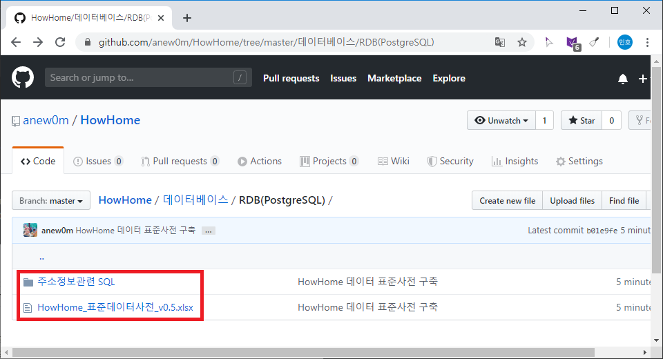
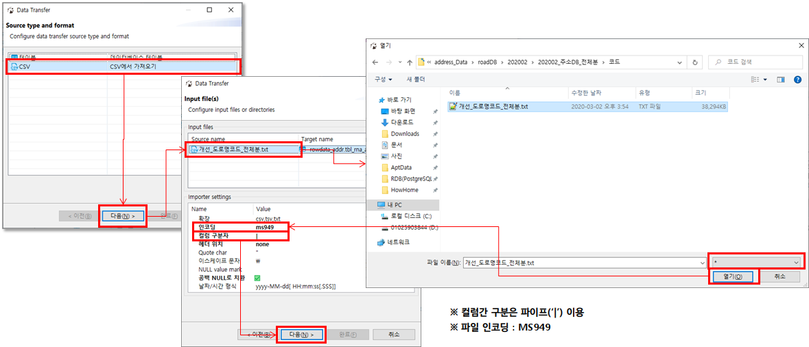
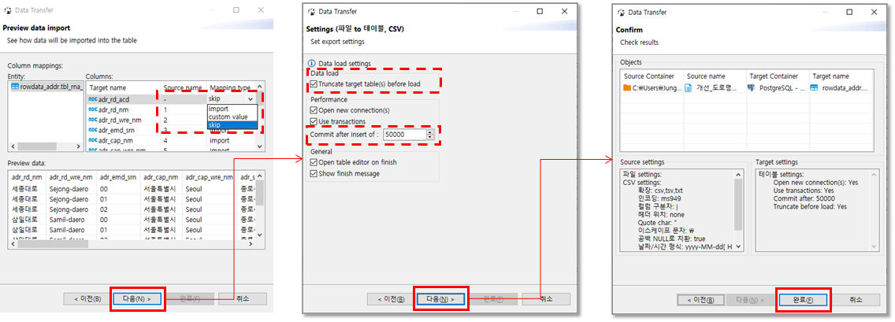
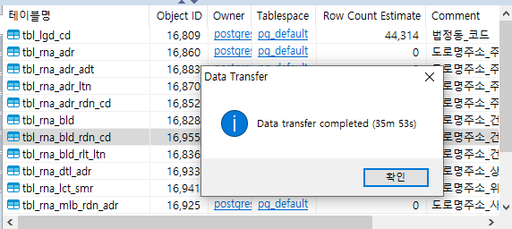

= 어떡하집 프로젝트 - 아파트 정보 수집 계획(아파트 정보 저장 방안 수립-1)
정민호
2020-03-15
:jbake-last_updated: 2020-03-15
:jbake-type: post
:jbake-status: published
:jbake-tags: 부동산, 개인프로젝트
:description: 버추얼박스에서 OS를 설치하고 DB를 설치하여 주소 데이터를 저장합니다.
:jbake-og: {"image": "img/jdk/duke.jpg"}
:idprefix:
:toc:
:sectnums:

== 들어가며
공공데이터 포털에서 받은 데이터를 DB에 저장하는 과정을 테스트하기 위해_(공공데이터 약관에따라 일반->서버구축으로 변경)_
임시로 가상머신에 CentOS-7 64비트 버전을 최소설치하고 PostgreSQL 11을 설치하고자 합니다.

가상머신 설치 및 SSH 설정, PostgreSQL 11 설치 방법은 구글에 검색하시거나 아래 링크를 참조해주시면 좋을것 같습니다.

- https://extrememanual.net/8513 - https://extrememanual.net/8513[버추얼박스(VirtualBox) CentOS7 설치하는 방법]
- https://blog.miyam.net/56 - https://blog.miyam.net/56[CentOS 7 SSH 설치]
- https://medium.com/@jinseok.choi/centos-7에서-postgresql-11-설치하기-77bc0da9d0af - https://medium.com/@jinseok.choi/centos-7%EC%97%90%EC%84%9C-postgresql-11-%EC%84%A4%EC%B9%98%ED%95%98%EA%B8%B0-77bc0da9d0af[Centos 7에서 PostgreSQL 11 설치하기]

== DB 접속 및 테이블 생성
저는 PostgreSQL DB 접속을 pgAdmin이 아닌 DBeaver를 통해 접속을 하였고, 주소 데이터를 관리할 rowdata 계정을 추가하였습니다.
도로명과 법정동 정보는 HowHome 프로젝트에서 사용할 용어로 표준화 하였습니다.

먼저 테이블 생성에 앞서 데이터 표준사전을 만든 후 테이블을 생성하였습니다.
데이터 표준사전의 기본 구성은 아래와 같고, 저는 별도로 원본 주소정보의 스키마 정보를 저장해 놓았습니다.
__(의도는 데이터 표준사전이었지만 프로젝트가 안정될 때까지 작업 겸용으로 유지할 계획입니다.)__

재개정이력:: 표준사전 변경시 어떤 변동사항이 있는지를 기록
원본주소정보:: 도로명과 법정동 원본 스키마 정보와 표준용어 매핑
단어분리:: 용어를 구성하는 최소 단어 단위로 분리
표준단어:: 단어의 의미와 약어(최대3자리) 정보 관리
표준도메인:: 데이터 도메인 분류와 데이터 타입 및 길이 정보 관리
표준용어:: 용어정보와 용어가 속해있는 표준 도메인 정보 관리
표준코드:: DB에서 사용될 공통코드 등 각종 코드 정보 관리
행정표준용어:: 표준단어 작성시 참조

표준 단어의 약어는 대략 아래의 규칙을 기반으로 작성하였습니다.

----
- 약어는 자음 3자리로하며, 연속된 자음은 사용하지 않음
( Password -> PSW )

- 첫번째 철자는 자음/모음 상관없이 반드시 사용
( Apple -> APL )

- 전체 단어 철자가 3자 이하인 단어는 그대로 사용
( ID, ETC )

- 영문명 내의 전치사(for, of, about, to by, as), 관사(a, an), 정관사(the), 접속사(and, or,that)는 영문약어를 생성할 때 대상에서 제외
( In And Out -> INO

- 중복 시 다음 자음 사용, 자음 모두 중복 시 처음 나오는 모음을 사용
( Password -> PAS(중복) -> PSR(중복) -> PSD(중복) -> PSS(중복) -> PWR(중복) -> PWD(중복) -> PRD(중복) ->
PAS(중복) -> PAW(중복) -> PAR(중복) -> PAD(중복) -> PSO(중복) -> PWO(중복) -> POR(중복) -> POD )

- 2단어로 된 복합어 사용시 앞의 단어에서 2자리 뒤의 단어에서 1자리로 약어 생성
( Left Right -> LFR, Keyboard Mouse -> KBM, The Rock -> RCK, A apple -> APL)

- 3단어로 된 복합어 사용시 각 단어의 첫글자로 약어 생성
( Left Middle Right -> LMR, Keyboard Mouse Monitor -> KMM, The Left Right -> LFR )

- 4단어 이상으로 된 복합어 사용시 앞의 단어에서 2자리 마지막 단어에서 1자리로 약어 생성
( Left Right Keyboard Mouse -> LFM, Left Keyboard Mouse Monitor -> LFS, The Rock a Apple -> RCA )
----

완성된 표준 사전 및 테이블 생성 스크립트는 아래 링크를 통해 다운로드 받으실 수 있습니다.

image::img/HowHome/AptData/05/AptData-05-Standard-02.png[표준사전]
image::img/HowHome/AptData/05/AptData-05-Standard-03.png[스크립트]

테이블 생성 스크립트를 실행하면 아래 그림과 같이 테이블이 생성 됩니다.

image::img/HowHome/AptData/05/AptData-05-Standard-04.png[테이블]

== DB 데이터 Import
PostgreSQL에 주소정보 데이터(*.csv)를 Import 하는 방법은 DBeaver와 psql의 copy 명령어를 이용하는 2가지 방법이 있습니다.
저는 두가지 방법 중 다소 불편하고 느린 방법이긴 하지만 DBeaver를 통해 데이터를 넣고자 합니다.

psql의 copy를 이용해보니 MS949 인코딩을 지원하지 않고, UTF-8로 변환하니 한글 데이터의 Byte가 2 -> 3으로 변경되다보니 문제가 발생하였습니다.
__(참고 : psql -h localhost -U postgres postgres -c "COPY rowdata_addr.tbl_rna_dtl_adr FROM '/mnt/public_folder/202002/202002_상세주소DB_전체분/adrdc/adrdc_all.csv'(DELIMITER '|', FORMAT CSV, ENCODING 'ms949');")__

먼저 DBeaver에 데이터를 Import 하기전 지역별로 분할되어 있는 파일을 하나로 합칩니다.
주소DB를 예로들면 코드, 부가정보, 주소, 지번 별로 데이터가 나뉘는것을 확인 할 수 있습니다.

따라서 각 분류별로 폴더를 생성하고 파일을 이동하고
명령프롬트프(CMD)를 본 폴더위치로 이동하여 'type *.txt > ../부가정보_all.txt' 를 실행하면,
상위폴더에 텍스트파일들이 합쳐진 '부가정보_all.txt' 이 생성된것을 학인할 수 있습니다.

image::img/HowHome/AptData/05/AptData-05-Standard-05.png[파일합치기]

스키마 내 테이블 목록에서 오른쪽 클릭하면 여러 항목들이 표출되는데 이 중 '데이터 가져오기'를 선택합니다.

image::img/HowHome/AptData/05/AptData-05-Standard-06.png[데이터가져오기1]

'CSV에서 가져오기'를 선택하고 '다음'을 선택합니다.
먼저 'Source_name'란을 선택하면 파일을 선택할 수 있는 파일브라우저가 표출되는데 주소DB의 '개선_도로명코드_전체분.txt'를 선택하겠습니다. (txt 파일이 보이지 않으면 우측하단의 *.csv를 * 또는 *.txt로 변경하시면 보입니다.)
그 다음 인코딩과 컬럼 구분자, 헤더구분을 가이드에 따라 각각 'ms949', '|', 'none'으로 변경하여 진행합니다.

Column mapping 에서 Columns가 매핑되지 않을 땐 skip을 선택하여 진행합니다.

Settings 에서 테이블을 비우고 데이터를 추가하길 원하면 'Truncate target table(s) before load' 를 선택합니다.
Commit after insert of 는 데이터를 커밋하는 주기를 설정하는데 저는 50,000 건 마다 Insert 할 수 있도록 설정 하였습니다.
(지나치게 짧거나 큰 주기로 Insert 을 하게 되면 속도저하의 원인이 될 수 있습니다.)

