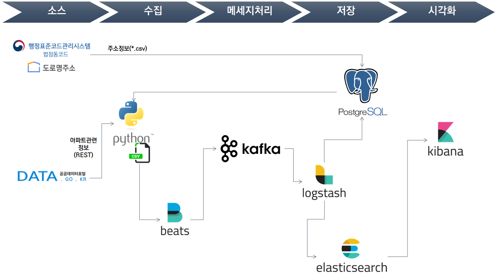

= 어떡하집 프로젝트 - 1차 시스템 구축 계획
정민호
2020-03-22
:jbake-last_updated: 2020-03-22
:jbake-type: post
:jbake-status: published
:jbake-tags: 부동산, 개인프로젝트
:description: 1차 시스템 목표로 Elastic 스택을 기반으로 데이터를 저장하고 시각화 합니다.
:jbake-og: {"image": "img/jdk/duke.jpg"}
:idprefix:
:toc:
:sectnums:

== 들어가며
기존에 ELK를 사용하던 경험이 있어 Elastic 스택을 사용하기로 결정하였습니다.
Logstash와 Fluentd 사이에서 고민을 하였지만, 아직 배경지식이 얕아 차후에 고민을 더 해보겠습니다.

제가 구상하는 시스템의 모토(?)는 아래와 같습니다. 생각되로 잘 될지는 모르겠지만 노력해 보겠습니다.

- PC에 종속적이지 않을 것
- 무중단 운영
- SW간 상호 독립적일 것
- 누구나 사용할 수 있을 것

우선 1차 시스템을 목표로 하고 저의 시야가 보

== 1차 : 시스템 구성도 및 데이터 흐름도
image::img/HowHome/Dev/01/HowHome_시스템구성도_1차.png[1차 시스템구성도]

위의 그림은 1차 시스템 구성도 입니다.
기본적으로 모든 시스템은 도커를 이용하여 컨테이너 기반으로 구성하였고, 이를 관리하기 위해 쿠버네티스와 앤서블을 사용할 계획입니다.
각 시스템을 컨테이너로 구성함으로써 개별 PC의 개별 도커로 운영될 수도 있고, 공용 PC의 공용 도커에서 운영될 수도 있습니다.

아래 그림은 1차 시스템의 데이터흐름도 입니다.

공공데이터포털이나 법정동코드, 도로명주소는 RDB 기반의 PostgreSQL 에 저장할 수 있도록 하였습니다.
현재는 주소 데이터를 CSV 파일 기반으로 받아서 수동으로 업로드 하고 있지만 차후 자동화할 계획입니다.

아파트 정보는 파이썬으로 수집하고 Filebeat를 이용해 Kafka로 전달하고, Logstash를 통해 Kafka가 전달받은 데이터를 가져와 Elasticsearch 또는 PostgreSQL에 저장하도록 합니다.
Elasticsearch에 저장되어 있는 데이터를 Kibana를 통해 시각화하여 보여줍니다.

== 데이터 수집 코드
파이썬으로 작성한 데이터 수집코드는 기존 단일 파일로 구현하였던것을 각 기능(역할)별로 파일로 나누어 리팩토링 하였습니다.
파이썬의 코드의 작성규칙은 https://www.python.org/dev/peps/pep-0008/[pep8]을 준수하려했지만 아직 완벽하지 않은것 같습니다.

image::img/HowHome/Dev/01/Python 수집소스 구성.png[1차 데이터흐름도]
