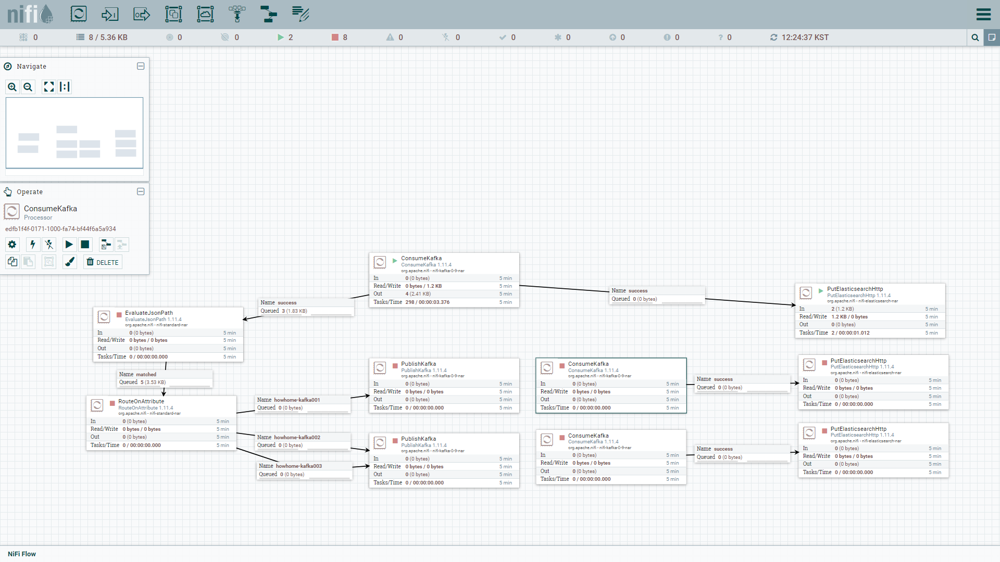

= 어떡하집 프로젝트 - 근황
정민호
2020-09-13
:jbake-last_updated: 2020-09-13
:jbake-type: post
:jbake-status: published
:jbake-tags: 부동산, 개인프로젝트
:description: 오랜기간 멈춰있던 시스템 개발의 근황을 전달드립니다.
:jbake-og: {"image": "img/jdk/duke.jpg"}
:idprefix:
:toc:
:sectnums:

== 2020.09.13 현재 상황
어떡하집 프로젝트는 04월 즘에 테스트 시스템까지 구축을 끝 마친 상태입니다.

시스템 구축 할 때 https://www.data.go.kr/[공공데이터포털]에서 아파트 실거래 정보를 가져오던 중 API를 제공하는 서버에 문제가있어서 일시중단하게되었습니다.
그 후 5~6월 즘 다시 아파트 실거래 정보를 가져오려했지만 문제가 해결되지 않아 아직까지 중단된 상태입니다.
왜 그런지는 모르겠지만 현재(2020.09.13)까지 해결 되지 않았습니다. 추후 본격적으로 작업을 다시 시작할 때 다시 문의를 해봐야겠습니다.

초기 설계에선 logstash를 사용하였지만 실제구축에선 logstash를 nifi로 변경하여 진행하였습니다.
아래 사진은 개발진행상태(?) 입니다.

image::img/HowHome/Dev/02/server.png[VB를 이용한 서버 구성]

